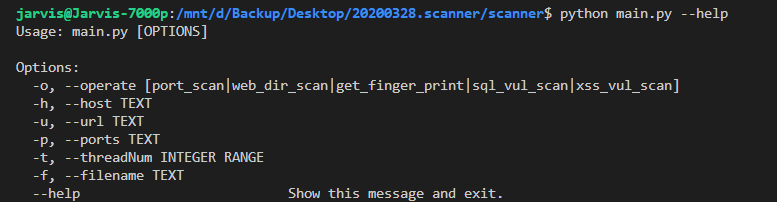
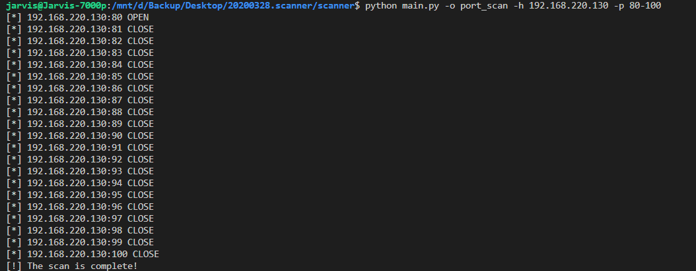
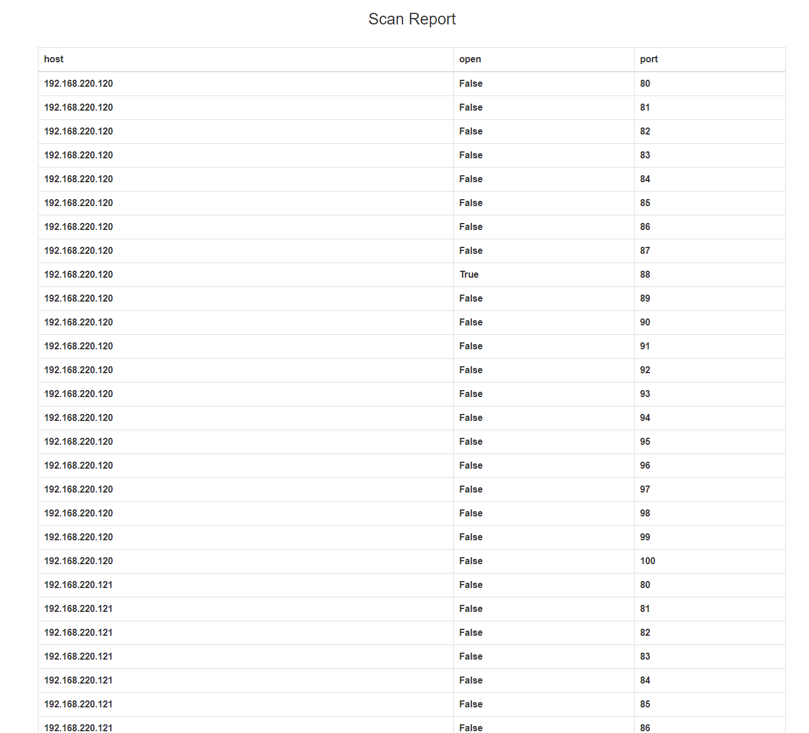
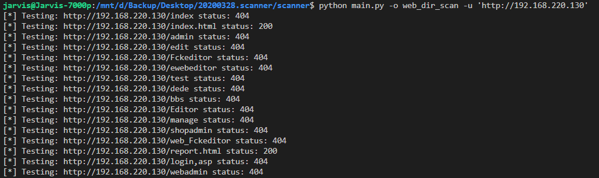
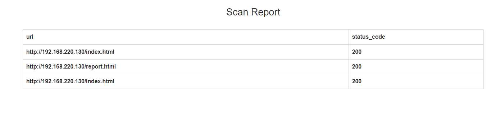
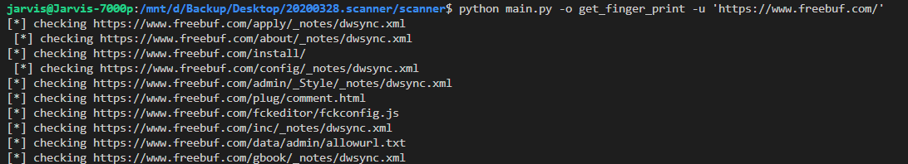
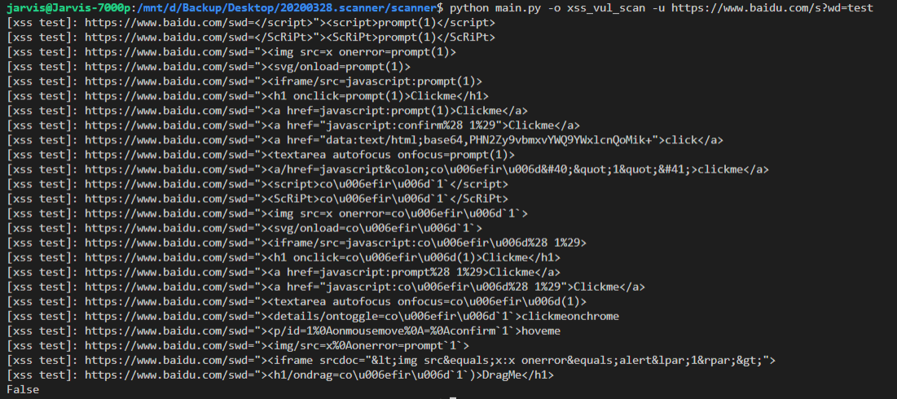
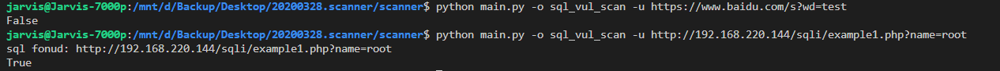
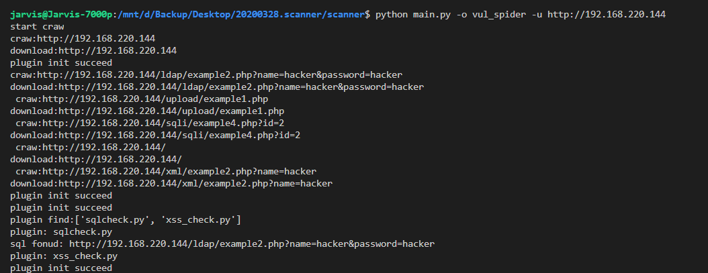
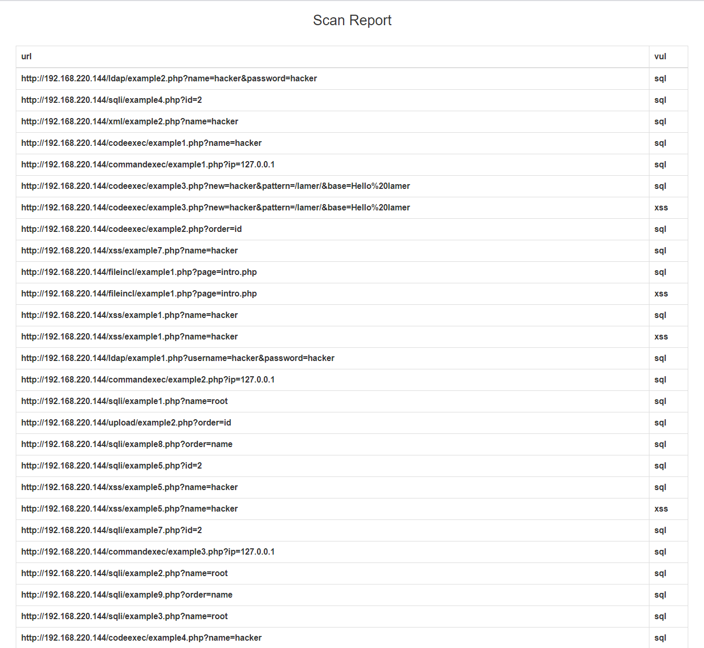

# Web Scanner

## 使用说明



- `-o, --operate` 指定扫描操作
    - port_scan 端口扫描
    - web_dir_scan 目录扫描
    - get_finger_print 获取web指纹
    - sql_vul_scan SQL注入扫描
    - xss_vul_scan XSS漏洞扫描

- `-h, --host` 指定要扫描的主机, 支持两种写法, 默认值为 `127.0.0.1`
    - 192.168.0.1
    - 192.168.0.1-120

- `-u, --url` 指定扫描的url(用于目录扫描和xss, sql漏洞扫描), 默认为 `localhost`

- `-p, --port` 指定要扫描的端口, 支持两种写法, 默认值为常见端口
    - 80
    - 80-100

- `-t, --threadNum` 指定扫描的线程数, 未必每个扫描都支持

- `f, --filename` 指定扫描结果导出的文件名, 默认为 `report.html`

- `--help` 查看关于参数的帮助信息

## 端口扫描

```bash
python main.py -o port_scan -h 192.168.220.120-135 -p 80-100
```






## 目录扫描

```bash
python main.py -o web_dir_scan -u 'http://192.168.220.130'
```





## web 指纹获取

```bash
 python main.py -o get_finger_print -u 'https://www.freebuf.com/'
```




## XSS 漏洞扫描

```bash
 python main.py -o xss_vul_scan -u https://www.baidu.com/s?wd=test
```




## SQL 漏洞扫描

```bash
python main.py -o sql_vul_scan -u http://192.168.220.144/sqli/example1.php?name=root
```



## Spider

```bash
python main.py -o vul_spider -u http://192.168.220.144
```


